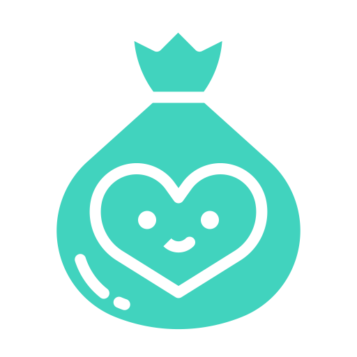
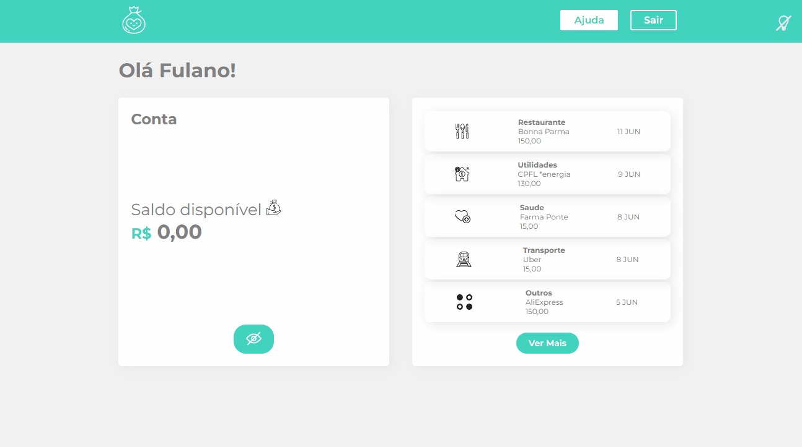

# Byte Bank | React: abstraindo seu CSS com Styled Components

Repositório com projeto Byte Bank desenvolvido durante o curso React: abstraindo seu CSS com Styled Components da [Alura](https://www.alura.com.br/) Escola Online de Tecnologia.

## 📁 Detalhes do projeto

	

 

O Byte Bank é um banco fictício com uma aplicação web para seus clientes. A proposta para esse projeto foi desenvolver novas funcionalidades como troca de temas, entre claro e escuro, e também um novo componente de status, para visualizar a movimentação da conta.

O projeto original utilizava CRA (npx create-react-app), porém por ter sido descontinuado optei por iniciar o projeto com Vitejs (npm create vite@latest). E para instalar o Styled Components utilizei o comando npm install "styled-components@5.3.10".

## 📚 Temas abordados

* Como criar componentes estilizados com o `Styled Components`;
* Uso de estilos globais para a aplicação;
* Heranças de estilo;
* Tratamento de media queries;
* Composição de elementos estilizados para criar novas telas;
* `Themeprovider` do Styled Components;
* Alterando cores de ícones SVG com `filters`;

## 🖥️ Como executar o projeto

	

 

Para abrir e rodar o projeto, execute `npm i` para instalar as dependências e `npm start` para iniciar o projeto.

Depois, acesse [http://localhost:3000/](http://localhost:3000/) no seu navegador.

## 👩‍💻 Tecnologias utilizadas

	
	
	
	

Desenvolvido com 💙 por [Juliana Lucca](https://www.linkedin.com/in/julianalucca/).

Projeto original desenvolvido por [Alura](https://www.alura.com.br/).